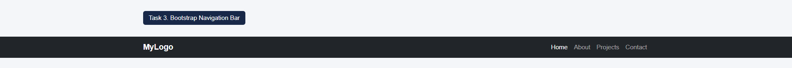
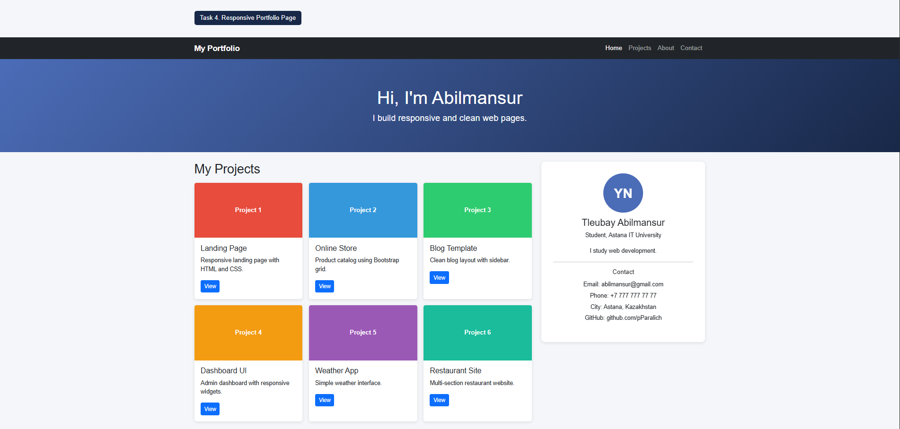

# Assignment #3. Responsive Web Design (Media Queries + Bootstrap Grid)

**Name:** Tleubay Abilmansur
**Group:** SE 2540

---

## Part 1. Media Queries

### Task 0. Responsive Typography
Create a simple webpage with headings and paragraphs. Use media queries to change font sizes for mobile, tablet, and desktop.

### Task 1. Responsive Layout with Media Queries
Three boxes in a row. Desktop: 3 side by side. Tablet: 2 in a row. Mobile: stacked. Only CSS media queries (no Bootstrap).

## Part 2. Bootstrap Grid System

### Task 2. Bootstrap Responsive Columns
12-column grid. Desktop: 3 x col-4. Tablet: 2 + 1. Mobile: stacked.

### Task 3. Bootstrap Navigation Bar
Logo on the left, links on the right, hamburger menu on smaller screens.

## Part 3. Combined Project

### Task 4. Responsive Portfolio Page
Header with Bootstrap navbar; main section with projects (left) and sidebar (right); footer. Custom media queries for font sizes, spacing and element visibility.

## Summary of my work process
I used a mobile-first approach: base styles are for phones, and `min-width` media queries (768px and 992px) add styles for tablets and desktops. These breakpoints match Bootstrap's `md` and `lg`, so my CSS and the grid work together.

- **Task 0:** changed font sizes with media queries.
- **Task 1:** three boxes with flexbox and media queries only: 1, 2, or 3 per row.
- **Task 2:** Bootstrap grid with `col-12 col-md-6 col-lg-4`.
- **Task 3:** navbar with `navbar-expand-lg` that collapses into a hamburger menu.
- **Task 4:** portfolio page combining the Bootstrap grid with custom media queries for font sizes, spacing, and hidden elements.

I tested everything in Chrome DevTools device mode and committed the work step by step.